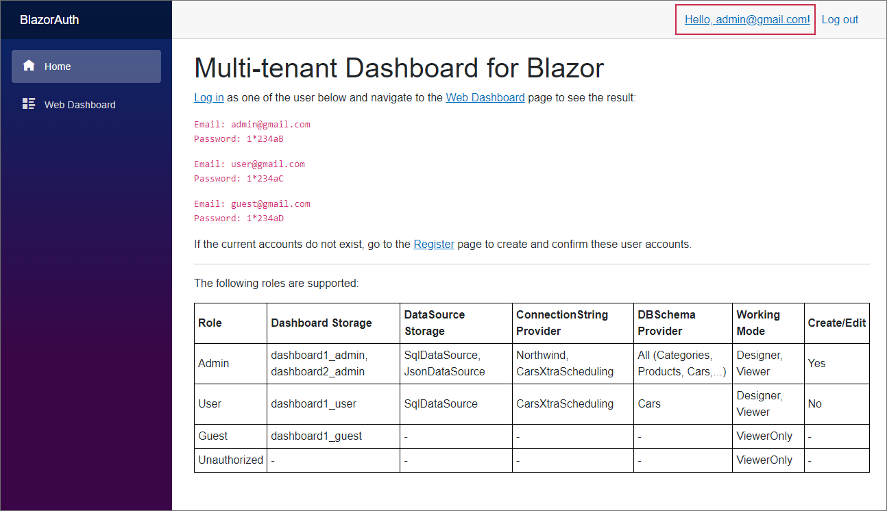

<!-- default badges list -->

[](https://supportcenter.devexpress.com/ticket/details/T1017576)
[](https://docs.devexpress.com/GeneralInformation/403183)
<!-- default badges end -->
# Dashboard for Blazor - How to Implement Multi-Tenant Dashboard Architecture using the ASP.NET Core's Identity Authentication System

This example shows how to configure the Dashboard component for Blazor so that it works in the multi-user environment. 

You can identify a user in the ASP.NET Core's `HttpContext.User` and return the user-specific content.



## How to Launch

This example was created based on the **Blazor Server App** Visual Studio template with the *Authentication Type = 'Individual Accounts'* setting (see [Secure ASP.NET Core Blazor Server apps](https://docs.microsoft.com/en-us/aspnet/core/blazor/security/server/?view=aspnetcore-5.0&tabs=visual-studio)). The example uses the [ASP.NET Core's Identity mechanism](https://docs.microsoft.com/en-us/aspnet/core/security/authentication/identity?view=aspnetcore-5.0&tabs=visual-studio) for authentication. For this reason, you need to follow the steps below to initialize the Identity database and register required user accounts in it:

1) Apply the `00000000000000_CreateIdentitySchema` migration to the `aspnet-BlazorAuth-9F8F37E8-C7E8-4D29-BFE6-47204A65FA44` database. You can run the following command in the Package Manager Console for this purpose:

   ```
   PM> Update-Database
   ```

2) In this example, the following user accounts were authorized:

   ```
   Email: admin@gmail.com
   Password: 1*234aB

   Email: user@gmail.com
   Password: 1*234aC

   Email: guest@gmail.com
   Password: 1*234aD
   ```

If the current accounts do not exist, go to the **Register** page (`Identity/Account/Register`) to create and confirm these user accounts.

## Example Overview

You can limit access to sensitive information depending on the current user's ID. The [MultiTenantDashboardConfigurator](./CS/Code/MultiTenantDashboardConfigurator.cs) class is an entry point for configuring all providers. Every custom store/provider reads the `IHttpContextAccessor.HttpContext.User.Identity`. In the `MultiTenantDashboardConfigurator` class, use the standard [IHttpContextAccessor](https://docs.microsoft.com/en-us/aspnet/core/fundamentals/http-context?view=aspnetcore-3.0) with dependency injection to access the HTTP context and pass the retrieved user name to Dashboard providers listed above. This class is registered as a *scoped* DI service in the [Startup.cs](./CS/Startup.cs) file.

When the application starts, you see the [Index](./CS/Pages/Index.razor) view where you can select a user. Use the **Log in** link for this purpose. Below is a table that illustrates the user IDs and their associated rights in this example:

| Role  | Dashboard Storage | DataSource Storage | ConnectionString Provider | DBSchema Provider | Working Mode | Create/Edit |
| --- | --- | --- | --- | --- | --- | --- |
| Admin | dashboard1_admin, dashboard2_admin | SqlDataSource, JsonDataSource | Northwind, CarsXtraScheduling | All (Categories, Products, Cars,...) | Designer, Viewer | Yes |
| User | dashboard1_user | SqlDataSource | CarsXtraScheduling | Cars | Designer, Viewer | No |
| Guest | dashboard1_guest | - | - | - | ViewerOnly | - |
| Unauthorized | - | - | - | - | ViewerOnly | - |


## Example Details

You can return the following user-specific content:

### Dashboards

Custom dashboard storage allows you to specify which dashboards the user can access, edit, and save. 

**API**: [IEditableDashboardStorage Interface](https://docs.devexpress.com/Dashboard/DevExpress.DashboardWeb.IEditableDashboardStorage) 

**Files to look at**: [CustomDashboardStorage.cs](./CS/Code/CustomDashboardStorage.cs)

### Data Sources

Custom data source storage allows you to specify which data sources are available to the user. 

**API**: [IDataSourceStorage Interface](https://docs.devexpress.com/Dashboard/DevExpress.DashboardWeb.IDataSourceStorage) 

**Files to look at**: [CustomDataSourceStorage.cs](./CS/Code/CustomDataSourceStorage.cs)

### Data Source Schema

A custom data source schema provider allows you to filter the data source for different users to show only a part of the data source.

**API**: [DBSchemaProviderEx Class](https://docs.devexpress.com/CoreLibraries/DevExpress.DataAccess.Sql.DBSchemaProviderEx)

**Files to look at**: [CustomDBSchemaProvider.cs](./CS/Code/CustomDBSchemaProvider.cs)

### Connection Strings

A custom connection string provider allows you to specify connection strings depending on the user's access rights.

**API**: [IDataSourceWizardConnectionStringsProvider Interface](https://docs.devexpress.com/CoreLibraries/DevExpress.DataAccess.Web.IDataSourceWizardConnectionStringsProvider) 

**Files to look at**: [CustomConnectionStringProvider.cs](./CS/Code/CustomConnectionStringProvider.cs)

### Working Mode

The Web Dashboard control can operate in `ViewerOnly` mode for unauthorized users. To do this, handle the [DashboardConfigurator.VerifyClientTrustLevel](https://docs.devexpress.com/Dashboard/DevExpress.DashboardWeb.DashboardConfigurator.VerifyClientTrustLevel) event and set the `e.ClientTrustLevel` property to `Restricted`. This setting prevents inadvertent or unauthorized modifications of dashboards stored on a server. You can find more information in the following help section: [Security Considerations - Working Mode Access Rights](https://docs.devexpress.com/Dashboard/118651/web-dashboard/general-information/security-considerations#working-mode-access-rights).

**API**: [DashboardConfigurator.VerifyClientTrustLevel Event](https://docs.devexpress.com/Dashboard/DevExpress.DashboardWeb.DashboardConfigurator.VerifyClientTrustLevel)

**Files to look at**: [Dashboard.razor](./CS/Pages/Dashboard.razor) and [MultiTenantDashboardConfigurator.cs](./CS/Code/MultiTenantDashboardConfigurator.cs)

## Documentation

- [Create an ASP.NET Core Dashboard Application](https://docs.devexpress.com/Dashboard/119284/get-started/build-web-dashboard-applications/create-an-aspnet-core-dashboard-application?p=netframework)
- [Manage Multi-Tenancy](https://docs.devexpress.com/Dashboard/402924/web-dashboard/dashboard-backend/manage-multi-tenancy)
- [ASP.NET Core Blazor authentication and authorization](https://docs.microsoft.com/en-us/aspnet/core/blazor/security/?view=aspnetcore-5.0)

## More Examples

- [Dashboard for ASP.NET Core - How to implement multi-tenant Dashboard architecture](https://github.com/DevExpress-Examples/DashboardUserBasedAspNetCore)
- [Dashboard for ASP.NET Core - How to load different data based on the current user](https://github.com/DevExpress-Examples/DashboardDifferentUserDataAspNetCore)
- [Dashboard for ASP.NET Core - How to implement authentication](https://github.com/DevExpress-Examples/ASPNET-Core-Dashboard-Authentication)
- [Dashboard for MVC - How to implement multi-tenant Dashboard architecture](https://github.com/DevExpress-Examples/DashboardUserBasedMVC)
- [Dashboard for MVC - How to load and save dashboards from/to a database](https://github.com/DevExpress-Examples/mvc-dashboard-how-to-load-and-save-dashboards-from-to-a-database-t400693)
- [Dashboard for MVC - How to load different data based on the current user](https://github.com/DevExpress-Examples/DashboardDifferentUserDataMVC)
